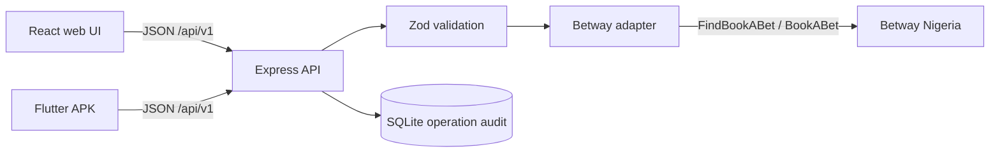
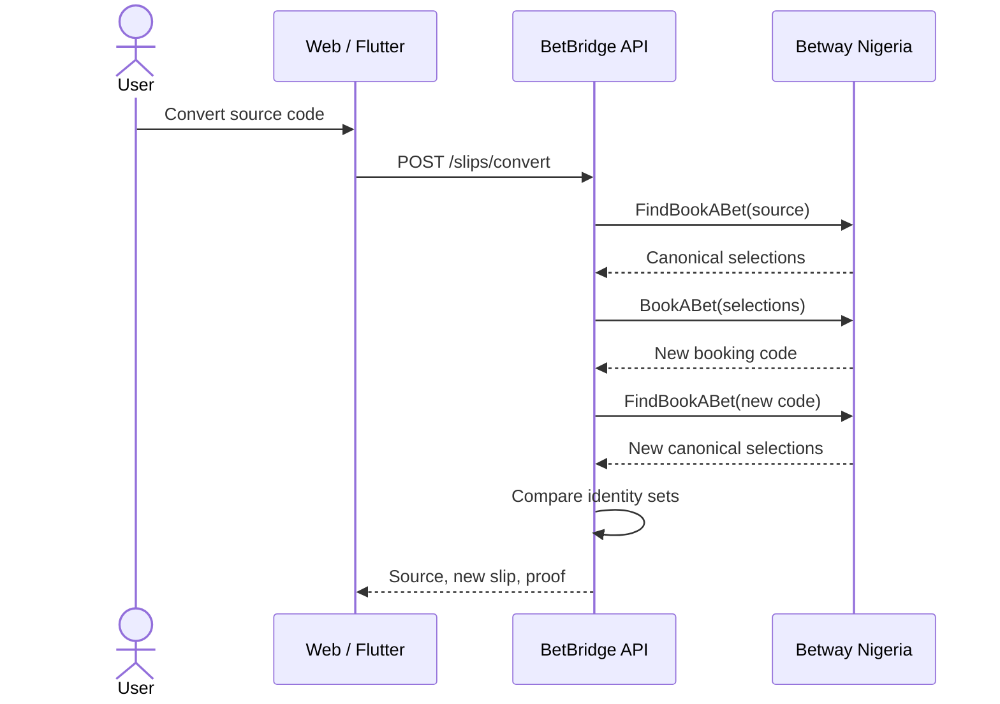

# BetBridge

BetBridge is a small full-stack product for Betway Nigeria booking codes. It performs all three requested operations against Betway's live operator services:

- **Decode** a code into events, markets, selections, prices, and availability.
- **Encode** Betway selection identities into a new code, reload it, and report whether the returned selection set is identical.
- **Convert** an existing code by decoding it, creating a fresh code for the same selections, re-decoding the new code, and comparing the two sets.

It includes a responsive React web app, an Express/SQLite backend, a Flutter slip viewer, tests, Docker deployment, and APK CI.

## Run locally

Requirements: Node.js 22+.

```bash
npm install
npm run dev
```

In another terminal:

```bash
npm run dev:web
```

Open `http://localhost:5173`. For the single-process production build:

```bash
npm run build
NODE_ENV=production npm start
```

PowerShell uses `$env:NODE_ENV='production'; npm.cmd start`.

## API

```text
POST /api/v1/slips/decode   { "code": "BW..." }
POST /api/v1/slips/encode   { "selections": [{ "eventId": 1, "marketId": "...", "outcomeId": "..." }] }
POST /api/v1/slips/convert  { "code": "BW..." }
GET  /api/v1/operations
GET  /healthz
```

`encode` and `convert` return a `verification` object. `matched: true` means the code was loaded back from Betway and its canonical `(eventId, marketId, outcomeId)` set exactly equals the requested set. This is stronger than trusting a successful create response.

## Architecture





The browser never calls Betway directly. That keeps operator details centralized, avoids browser CORS dependence, and gives one stable contract to both clients. SQLite stores operational metadata only—operation, status, duration, selection count, and time—not account or payment data.

## Correctness and edge cases

- Codes are normalized to uppercase and strictly validated.
- Selection identity is preserved as strings because Betway market/outcome IDs can contain non-numeric suffixes.
- Suspended, expired, or price-1 legs remain visible and are marked unavailable.
- Duplicate selection identities are removed before encoding.
- Every upstream request has a timeout and errors are mapped to stable public codes.
- Odds are live. A code may change between calls; the UI shows the fetch time and verification mismatch instead of claiming success.
- No Betway login, bet placement, stake, or payment operation is performed.

## Test and build

```bash
npm test
npm run typecheck
npm run build
```

The tests cover response normalization, encode verification, upstream error mapping, HTTP validation, telemetry, and health checks.

## Deployment

The repository includes a production multi-stage `Dockerfile` and a Render Blueprint. Push the repository to GitHub, create a new Render Blueprint from it, and Render supplies the public URL. Set `VITE_REPOSITORY_URL` during the build if the header should link to the final repository.

The default SQLite path in `render.yaml` is ephemeral because the data is non-critical telemetry. For persistent history, attach a Render disk and set `DATABASE_PATH` to its mount path, or replace the small `OperationStore` interface with Postgres.

## Flutter / APK

The Flutter client lives in [`mobile_flutter`](./mobile_flutter) and intentionally implements the requested slip view rather than duplicating every web authoring screen. Its API URL is injected at build time:

```bash
cd mobile_flutter
flutter create --platforms android --org com.betbridge --project-name betbridge_mobile .
flutter pub get
flutter test
flutter build apk --release --dart-define=API_BASE_URL=https://your-live-url.example
```

The **Flutter APK** GitHub Actions workflow performs those steps and uploads `app-release.apk` as an artifact. Start it with **Run workflow** and enter the deployed web URL.

## Submission assets

- [Architecture and decisions](./docs/DECISIONS.md)
- [Five-minute walkthrough script](./docs/WALKTHROUGH.md)
- [iOS / IPA path](./docs/IOS.md)
- [Submission checklist](./docs/SUBMISSION_CHECKLIST.md)

BetBridge is an independent technical demonstration and is not affiliated with Betway. 18+; gamble responsibly.
